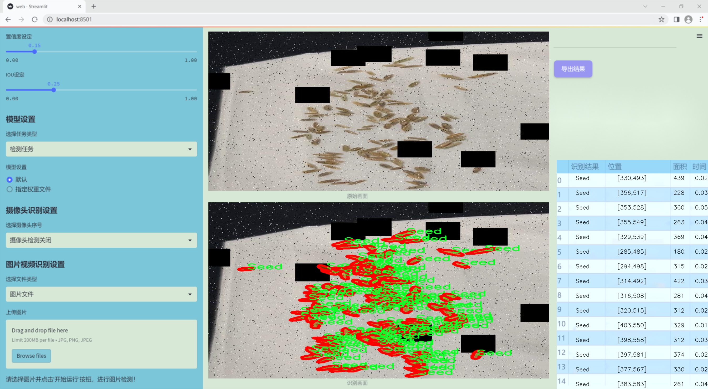
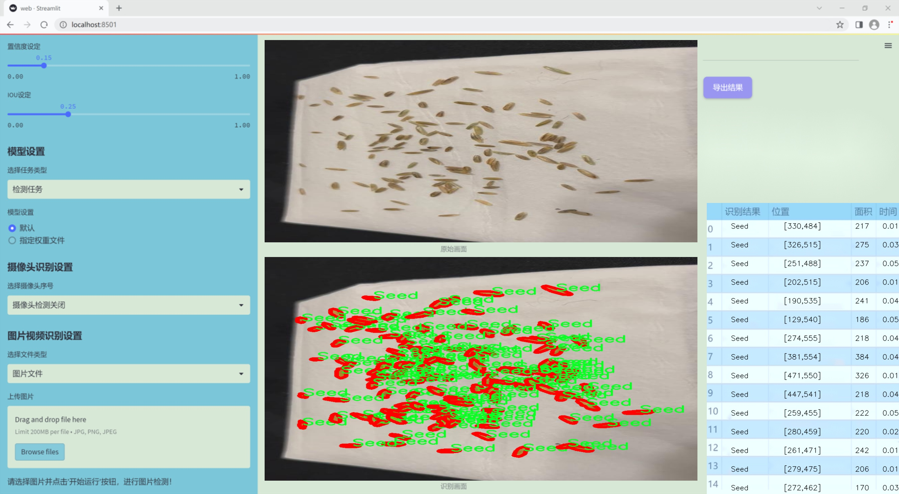
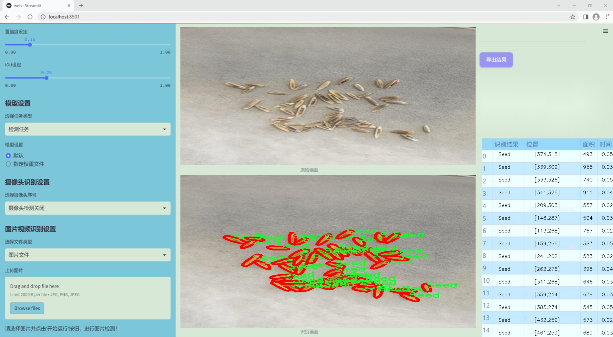
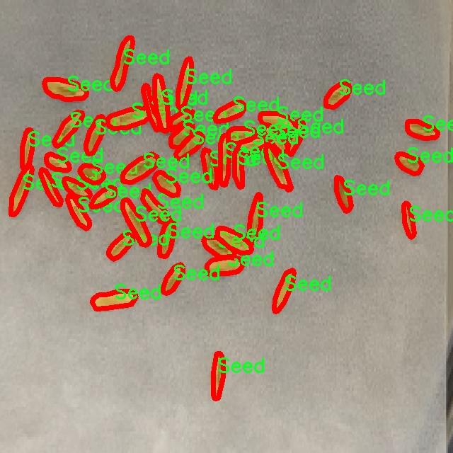
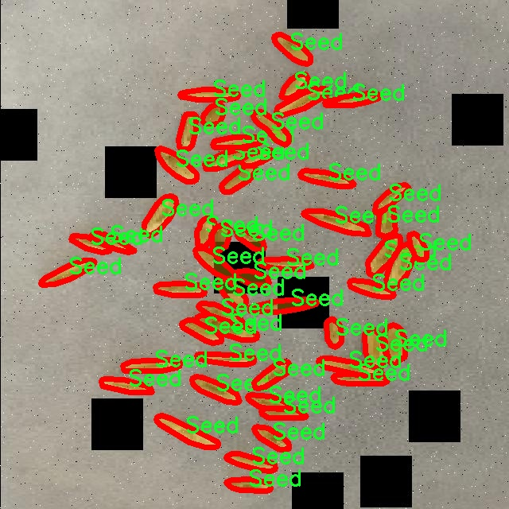
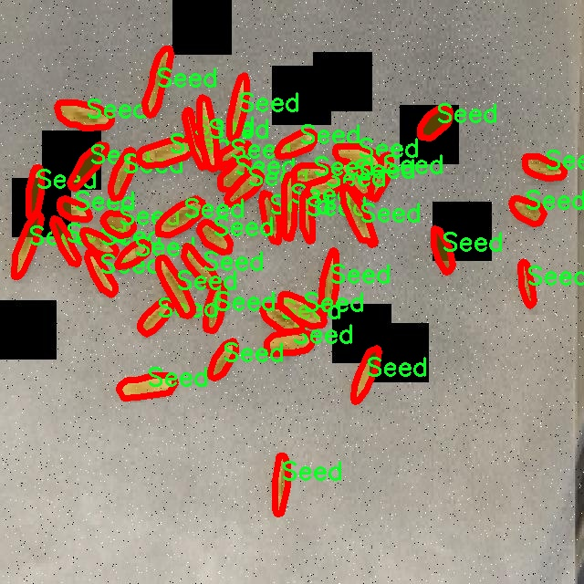
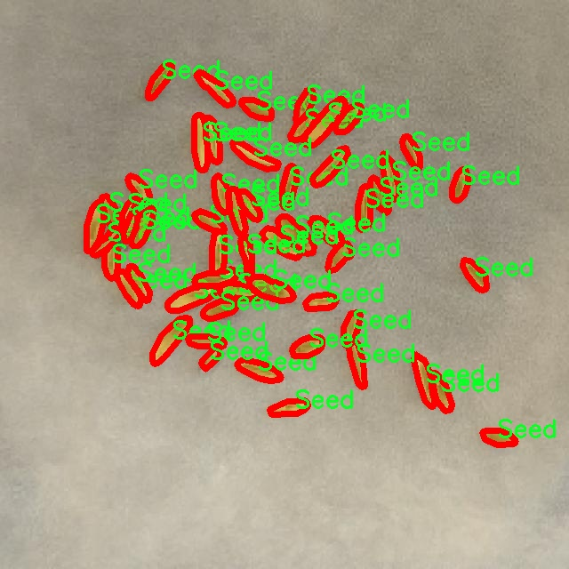
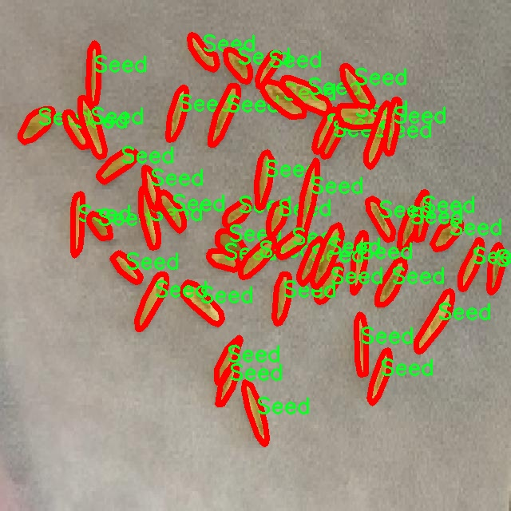

### 1.背景意义

研究背景与意义

随着全球农业生产的不断发展，种子作为植物生长的基础，其数量的准确计数在农业管理、种子生产和品质控制等方面显得尤为重要。传统的种子计数方法往往依赖人工操作，不仅耗时耗力，而且容易受到人为因素的影响，导致计数结果的不准确。因此，开发一种高效、准确的自动化种子计数系统具有重要的现实意义。

近年来，计算机视觉技术的快速发展为种子计数提供了新的解决方案。YOLO（You Only Look Once）系列目标检测算法因其高效性和准确性而广泛应用于各种视觉识别任务。特别是YOLOv11的出现，进一步提升了目标检测的性能，使其在复杂背景下仍能保持较高的检测精度。基于YOLOv11的种子计数检测系统，能够通过对种子图像的实时分析，实现自动化计数，不仅提高了工作效率，还减少了人为错误的可能性。

本研究将利用一个包含313张种子图像的数据集，该数据集经过精心标注，确保了训练模型的高质量。数据集中的种子图像经过多种预处理和增强技术的处理，提升了模型的鲁棒性和适应性。通过对YOLOv11算法的改进，结合该数据集的特性，我们期望能够构建一个准确、快速的种子计数检测系统，为农业生产提供科学的决策支持。

综上所述，基于改进YOLOv11的种子计数检测系统不仅能够提升种子计数的效率和准确性，还将推动农业智能化的发展，为实现精准农业提供有力的技术支撑。这一研究不仅具有重要的学术价值，也为实际应用提供了可行的解决方案，具有广泛的推广前景。

### 2.视频效果

[2.1 视频效果](https://www.bilibili.com/video/BV1GBBrYkEZt/)

### 3.图片效果







##### [项目涉及的源码数据来源链接](https://kdocs.cn/l/cszuIiCKVNis)**

注意：本项目提供训练的数据集和训练教程,由于版本持续更新,暂不提供权重文件（best.pt）,请按照6.训练教程进行训练后实现上图演示的效果。

### 4.数据集信息

##### 4.1 本项目数据集类别数＆类别名

nc: 1
names: ['Seed']


该项目为【图像分割】数据集，请在【训练教程和Web端加载模型教程（第三步）】这一步的时候按照【图像分割】部分的教程来训练

##### 4.2 本项目数据集信息介绍

本项目数据集信息介绍

本项目旨在开发一个改进的YOLOv11种子计数检测系统，为此我们使用了名为“Seed Counter v3”的数据集。该数据集专注于种子计数的任务，提供了丰富的图像样本，旨在提高计算机视觉模型在种子检测和计数方面的准确性和效率。数据集中包含的类别数量为1，具体类别为“Seed”，这意味着所有图像均围绕这一主题展开，确保了数据集的专一性和针对性。

“Seed Counter v3”数据集中的图像涵盖了多种种子类型和生长阶段，提供了不同背景、光照条件和视角下的种子图像。这种多样性不仅有助于提高模型的泛化能力，还能使其在实际应用中表现得更加稳健。数据集中的每张图像都经过精心标注，确保种子的边界框准确无误，从而为YOLOv11模型的训练提供了高质量的监督信号。

此外，数据集的设计考虑到了种子计数的实际应用场景，包含了不同密度和排列方式的种子图像，旨在模拟真实环境中的挑战。这种设计使得模型在处理复杂场景时能够更好地识别和计数种子，从而提高其在农业、生态监测等领域的应用潜力。

通过使用“Seed Counter v3”数据集，我们期望改进YOLOv11的种子计数检测系统，使其在种子识别和计数方面达到更高的准确率和效率。这将为相关领域的研究和实践提供重要的技术支持，推动智能农业和自动化监测的发展。











### 5.全套项目环境部署视频教程（零基础手把手教学）

[5.1 所需软件PyCharm和Anaconda安装教程（第一步）](https://www.bilibili.com/video/BV1BoC1YCEKi/?spm_id_from=333.999.0.0&vd_source=bc9aec86d164b67a7004b996143742dc)


[5.2 安装Python虚拟环境创建和依赖库安装视频教程（第二步）](https://www.bilibili.com/video/BV1ZoC1YCEBw?spm_id_from=333.788.videopod.sections&vd_source=bc9aec86d164b67a7004b996143742dc)

### 6.改进YOLOv11训练教程和Web_UI前端加载模型教程（零基础手把手教学）

[6.1 改进YOLOv11训练教程和Web_UI前端加载模型教程（第三步）](https://www.bilibili.com/video/BV1BoC1YCEhR?spm_id_from=333.788.videopod.sections&vd_source=bc9aec86d164b67a7004b996143742dc)


按照上面的训练视频教程链接加载项目提供的数据集，运行train.py即可开始训练



     Epoch   gpu_mem       box       obj       cls    labels  img_size
     1/200     20.8G   0.01576   0.01955  0.007536        22      1280: 100%|██████████| 849/849 [14:42<00:00,  1.04s/it]
               Class     Images     Labels          P          R     mAP@.5 mAP@.5:.95: 100%|██████████| 213/213 [01:14<00:00,  2.87it/s]
                 all       3395      17314      0.994      0.957      0.0957      0.0843

     Epoch   gpu_mem       box       obj       cls    labels  img_size
     2/200     20.8G   0.01578   0.01923  0.007006        22      1280: 100%|██████████| 849/849 [14:44<00:00,  1.04s/it]
               Class     Images     Labels          P          R     mAP@.5 mAP@.5:.95: 100%|██████████| 213/213 [01:12<00:00,  2.95it/s]
                 all       3395      17314      0.996      0.956      0.0957      0.0845

     Epoch   gpu_mem       box       obj       cls    labels  img_size
     3/200     20.8G   0.01561    0.0191  0.006895        27      1280: 100%|██████████| 849/849 [10:56<00:00,  1.29it/s]
               Class     Images     Labels          P          R     mAP@.5 mAP@.5:.95: 100%|███████   | 187/213 [00:52<00:00,  4.04it/s]
                 all       3395      17314      0.996      0.957      0.0957      0.0845


###### [项目数据集下载链接](https://kdocs.cn/l/cszuIiCKVNis)

### 7.原始YOLOv11算法讲解


###### YOLOv11改进方向

与YOLOv 10相比，YOLOv 11有了巨大的改进，包括但不限于：

  * 增强的模型结构：模型具有改进的模型结构，以获取图像处理并形成预测
  * GPU优化：这是现代ML模型的反映，GPU训练ML模型在速度和准确性上都更好。
  * 速度：YOLOv 11模型现在经过增强和GPU优化以用于训练。通过优化，这些模型比它们的前版本快得多。在速度上达到了25%的延迟减少！
  * 更少的参数：更少的参数允许更快的模型，但v11的准确性不受影响
  * 更具适应性：更多支持的任务YOLOv 11支持多种类型的任务、多种类型的对象和多种类型的图像。

###### YOLOv11功能介绍

Glenn Jocher和他的团队制作了一个令人敬畏的YOLOv 11迭代，并且在图像人工智能的各个方面都提供了YOLO。YOLOv 11有多种型号，包括：

  * 对象检测-在训练时检测图像中的对象
  * 图像分割-超越对象检测，分割出图像中的对象
  * 姿态检测-当用点和线训练时绘制一个人的姿势
  * 定向检测（OBB）：类似于对象检测，但包围盒可以旋转
  * 图像分类-在训练时对图像进行分类

使用Ultralytics Library，这些模型还可以进行优化，以：

  * 跟踪-可以跟踪对象的路径
  * 易于导出-库可以以不同的格式和目的导出
  * 多场景-您可以针对不同的对象和图像训练模型

此外，Ultralytics还推出了YOLOv 11的企业模型，该模型将于10月31日发布。这将与开源的YOLOv
11模型并行，但将拥有更大的专有Ultralytics数据集。YOLOv 11是“建立在过去的成功”的其他版本的之上。

###### YOLOv11模型介绍

YOLOv 11附带了边界框模型（无后缀），实例分割（-seg），姿态估计（-pose），定向边界框（-obb）和分类（-cls）。

这些也有不同的尺寸：纳米（n），小（s），中（m），大（l），超大（x）。


YOLOv11模型

###### YOLOv11与前版本对比

与YOLOv10和YOLOv8相比，YOLOv11在Ultralytics的任何帖子中都没有直接提到。所以我会收集所有的数据来比较它们。感谢Ultralytics：

**检测：**


YOLOv11检测统计


YOLOv10检测统计

其中，Nano的mAPval在v11上为39.5，v10上为38.5；Small为47.0 vs 46.3，Medium为51.5 vs
51.1，Large为53.4 vs 53.2，Extra Large为54.7vs
54.4。现在，这可能看起来像是一种增量增加，但小小数的增加可能会对ML模型产生很大影响。总体而言，YOLOv11以0.3
mAPval的优势追平或击败YOLOv10。

现在，我们必须看看速度。在延迟方面，Nano在v11上为1.55 , v10上为1.84，Small为2.46 v2.49，Medium为4.70
v4.74，Large为6.16 v7.28，Extra Large为11.31
v10.70。延迟越低越好。YOLOv11提供了一个非常低的延迟相比，除了特大做得相当差的前身。

总的来说，Nano模型是令人振奋的，速度更快，性能相当。Extra Large在性能上有很好的提升，但它的延迟非常糟糕。

**分割：**


YOLOV11 分割统计


YOLOV9 分割统计


YOLOV8 分割数据

总体而言，YOLOv 11上的分割模型在大型和超大型模型方面比上一代YOLOv 8和YOLOv 9做得更好。

YOLOv 9 Segmentation没有提供任何关于延迟的统计数据。比较YOLOv 11延迟和YOLOv 8延迟，发现YOLOv 11比YOLOv
8快得多。YOLOv 11将大量GPU集成到他们的模型中，因此期望他们的模型甚至比CPU测试的基准更快！

姿态估计：


YOLOV11姿态估计统计


YOLOV8姿态估计统计

YOLOv 11的mAP 50 -95统计量也逐渐优于先前的YOLOv 8（除大型外）。然而，在速度方面，YOLOv
11姿势可以最大限度地减少延迟。其中一些延迟指标是版本的1/4！通过对这些模型进行GPU训练优化，我可以看到指标比显示的要好得多。

**定向边界框：**


YOLOv11 OBB统计


YOLOv8 OBB统计

OBB统计数据在mAP
50上并不是很好，只有非常小的改进，在某种程度上小于检测中的微小改进。然而，从v8到v11的速度减半，这表明YOLOv11在速度上做了很多努力。

**最后，分类：**


YOLOv 11 CLS统计


YOLOv8 CLS统计

从v8到v11，准确性也有了微小的提高。然而，速度大幅上升，CPU速度更快的型号。


### 8.200+种全套改进YOLOV11创新点原理讲解

#### 8.1 200+种全套改进YOLOV11创新点原理讲解大全

由于篇幅限制，每个创新点的具体原理讲解就不全部展开，具体见下列网址中的改进模块对应项目的技术原理博客网址【Blog】（创新点均为模块化搭建，原理适配YOLOv5~YOLOv11等各种版本）

[改进模块技术原理博客【Blog】网址链接](https://gitee.com/qunmasj/good)


#### 8.2 精选部分改进YOLOV11创新点原理讲解

###### 这里节选部分改进创新点展开原理讲解(完整的改进原理见上图和[改进模块技术原理博客链接](https://gitee.com/qunmasj/good)【如果此小节的图加载失败可以通过CSDN或者Github搜索该博客的标题访问原始博客，原始博客图片显示正常】
### CBAM空间注意力机制
近年来，随着深度学习研究方向的火热，注意力机制也被广泛地应用在图像识别、语音识别和自然语言处理等领域，注意力机制在深度学习任务中发挥着举足轻重的作用。注意力机制借鉴于人类的视觉系统，例如，人眼在看到一幅画面时，会倾向于关注画面中的重要信息，而忽略其他可见的信息。深度学习中的注意力机制和人类视觉的注意力机制相似，通过扫描全局数据，从大量数据中选择出需要重点关注的、对当前任务更为重要的信息，然后对这部分信息分配更多的注意力资源，从这些信息中获取更多所需要的细节信息，而抑制其他无用的信息。而在深度学习中，则具体表现为给感兴趣的区域更高的权重，经过网络的学习和调整，得到最优的权重分配，形成网络模型的注意力，使网络拥有更强的学习能力，加快网络的收敛速度。
注意力机制通常可分为软注意力机制和硬注意力机制[4-5]。软注意力机制在选择信息时，不是从输入的信息中只选择1个，而会用到所有输入信息，只是各个信息对应的权重分配不同，然后输入网络模型进行计算;硬注意力机制则是从输入的信息中随机选取一个或者选择概率最高的信息，但是这一步骤通常是不可微的，导致硬注意力机制更难训练。因此，软注意力机制应用更为广泛，按照原理可将软注意力机制划分为:通道注意力机制（channel attention)、空间注意力机制(spatial attention）和混合域注意力机制(mixed attention)。
通道注意力机制的本质建立各个特征通道之间的重要程度，对感兴趣的通道进行重点关注，弱化不感兴趣的通道的作用;空间注意力的本质则是建模了整个空间信息的重要程度，然后对空间内感兴趣的区域进行重点关注，弱化其余非感兴趣区域的作用;混合注意力同时运用了通道注意力和空间注意力，两部分先后进行或并行，形成对通道特征和空间特征同时关注的注意力模型。

卷积层注意力模块(Convolutional Block Attention Module，CBAM）是比较常用的混合注意力模块，其先后集中了通道注意力模块和空间注意力模块，网络中加入该模块能有效提高网络性能，减少网络模型的计算量，模块结构如图所示。输入特征图首先经过分支的通道注意力模块，然后和主干的原特征图融合，得到具有通道注意力的特征图，接着经过分支的空间注意力模块，在和主干的特征图融合后，得到同时具有通道特征注意力和空间特征注意力的特征图。CBAM模块不改变输入特征图的大小，因此该模块是一个“即插即用”的模块，可以插入网络的任何位置。

通道注意力模块的结构示意图如图所示，通道注意力模块分支并行地对输入的特征图进行最大池化操作和平均池化操作，然后利用多层感知机对结果进行变换，得到应用于两个通道的变换结果，最后经过sigmoid激活函数将变换结果融合，得到具有通道注意力的通道特征图。

空间注意力模块示意图如图所示，将通道注意力模块输出的特征图作为该模块的输入特征图，首先对输入特征图进行基于通道的最大池化操作和平均池化操作，将两部分得到的结果拼接起来，然后通过卷积得到降为Ⅰ通道的特征图，最后通过sigmoid激活函数生成具有空间注意力的特征图。


### 9.系统功能展示

图9.1.系统支持检测结果表格显示

  图9.2.系统支持置信度和IOU阈值手动调节

  图9.3.系统支持自定义加载权重文件best.pt(需要你通过步骤5中训练获得)

  图9.4.系统支持摄像头实时识别

  图9.5.系统支持图片识别

  图9.6.系统支持视频识别

  图9.7.系统支持识别结果文件自动保存

  图9.8.系统支持Excel导出检测结果数据


### 10. YOLOv11核心改进源码讲解

#### 10.1 hcfnet.py

以下是对给定代码的核心部分进行分析和详细注释的结果。保留了最重要的类和方法，去掉了冗余的部分。

```python
import math
import torch
import torch.nn as nn
import torch.nn.functional as F

# 定义空间注意力模块
class SpatialAttentionModule(nn.Module):
    def __init__(self):
        super(SpatialAttentionModule, self).__init__()
        # 2通道输入，1通道输出的卷积层
        self.conv2d = nn.Conv2d(in_channels=2, out_channels=1, kernel_size=7, stride=1, padding=3)
        self.sigmoid = nn.Sigmoid()  # Sigmoid激活函数

    def forward(self, x):
        # 计算输入x的平均值和最大值
        avgout = torch.mean(x, dim=1, keepdim=True)  # 平均值
        maxout, _ = torch.max(x, dim=1, keepdim=True)  # 最大值
        out = torch.cat([avgout, maxout], dim=1)  # 拼接平均值和最大值
        out = self.sigmoid(self.conv2d(out))  # 经过卷积和Sigmoid激活
        return out * x  # 乘以输入x，得到加权后的输出

# 定义局部全局注意力模块
class LocalGlobalAttention(nn.Module):
    def __init__(self, output_dim, patch_size):
        super().__init__()
        self.output_dim = output_dim
        self.patch_size = patch_size
        self.mlp1 = nn.Linear(patch_size * patch_size, output_dim // 2)  # MLP层1
        self.norm = nn.LayerNorm(output_dim // 2)  # 层归一化
        self.mlp2 = nn.Linear(output_dim // 2, output_dim)  # MLP层2
        self.conv = nn.Conv2d(output_dim, output_dim, kernel_size=1)  # 1x1卷积
        self.prompt = torch.nn.parameter.Parameter(torch.randn(output_dim, requires_grad=True))  # 可学习的参数
        self.top_down_transform = torch.nn.parameter.Parameter(torch.eye(output_dim), requires_grad=True)  # 可学习的参数

    def forward(self, x):
        x = x.permute(0, 2, 3, 1)  # 调整维度顺序
        B, H, W, C = x.shape  # B: 批量大小, H: 高度, W: 宽度, C: 通道数
        P = self.patch_size

        # 局部分支
        local_patches = x.unfold(1, P, P).unfold(2, P, P)  # 提取局部patch
        local_patches = local_patches.reshape(B, -1, P * P, C)  # 重塑形状
        local_patches = local_patches.mean(dim=-1)  # 计算每个patch的平均值

        local_patches = self.mlp1(local_patches)  # 经过MLP层1
        local_patches = self.norm(local_patches)  # 归一化
        local_patches = self.mlp2(local_patches)  # 经过MLP层2

        local_attention = F.softmax(local_patches, dim=-1)  # 计算softmax得到注意力权重
        local_out = local_patches * local_attention  # 加权输出

        # 计算余弦相似度并生成mask
        cos_sim = F.normalize(local_out, dim=-1) @ F.normalize(self.prompt[None, ..., None], dim=1)  # 计算余弦相似度
        mask = cos_sim.clamp(0, 1)  # 限制在[0, 1]范围内
        local_out = local_out * mask  # 应用mask
        local_out = local_out @ self.top_down_transform  # 变换

        # 恢复形状并进行上采样
        local_out = local_out.reshape(B, H // P, W // P, self.output_dim)  # 重塑形状
        local_out = local_out.permute(0, 3, 1, 2)  # 调整维度顺序
        local_out = F.interpolate(local_out, size=(H, W), mode='bilinear', align_corners=False)  # 上采样
        output = self.conv(local_out)  # 经过1x1卷积

        return output  # 返回输出

# 定义PPA模块
class PPA(nn.Module):
    def __init__(self, in_features, filters) -> None:
        super().__init__()
        self.skip = nn.Conv2d(in_features, filters, kernel_size=1)  # 跳跃连接
        self.c1 = nn.Conv2d(filters, filters, kernel_size=3, padding=1)  # 卷积层1
        self.c2 = nn.Conv2d(filters, filters, kernel_size=3, padding=1)  # 卷积层2
        self.c3 = nn.Conv2d(filters, filters, kernel_size=3, padding=1)  # 卷积层3
        self.sa = SpatialAttentionModule()  # 空间注意力模块
        self.lga2 = LocalGlobalAttention(filters, 2)  # 局部全局注意力模块2
        self.lga4 = LocalGlobalAttention(filters, 4)  # 局部全局注意力模块4
        self.bn1 = nn.BatchNorm2d(filters)  # 批归一化
        self.silu = nn.SiLU()  # SiLU激活函数

    def forward(self, x):
        x_skip = self.skip(x)  # 跳跃连接
        x_lga2 = self.lga2(x_skip)  # 局部全局注意力模块2
        x_lga4 = self.lga4(x_skip)  # 局部全局注意力模块4
        x1 = self.c1(x)  # 卷积层1
        x2 = self.c2(x1)  # 卷积层2
        x3 = self.c3(x2)  # 卷积层3
        x = x1 + x2 + x3 + x_skip + x_lga2 + x_lga4  # 合并所有特征
        x = self.bn1(x)  # 批归一化
        x = self.silu(x)  # SiLU激活
        return x  # 返回输出

# 定义DASI模块
class DASI(nn.Module):
    def __init__(self, in_features, out_features) -> None:
        super().__init__()
        self.tail_conv = nn.Conv2d(out_features, out_features, kernel_size=1)  # 尾部卷积
        self.conv = nn.Conv2d(out_features // 2, out_features // 4, kernel_size=1)  # 卷积层
        self.bns = nn.BatchNorm2d(out_features)  # 批归一化
        self.skips = nn.Conv2d(in_features[1], out_features, kernel_size=1)  # 跳跃连接

    def forward(self, x_list):
        x_low, x, x_high = x_list  # 解包输入
        x = self.skips(x)  # 跳跃连接
        x_skip = x  # 保存跳跃连接的输出
        x = torch.chunk(x, 4, dim=1)  # 将x分成4个部分

        # 处理不同的输入组合
        if x_high is not None:
            x_high = self.skips(x_high)
            x_high = torch.chunk(x_high, 4, dim=1)
        if x_low is not None:
            x_low = self.skips(x_low)
            x_low = F.interpolate(x_low, size=[x.size(2), x.size(3)], mode='bilinear', align_corners=True)
            x_low = torch.chunk(x_low, 4, dim=1)

        # 结合不同来源的特征
        x0 = self.conv(torch.cat((x[0], x_low[0]), dim=1)) if x_low is not None else self.conv(x[0])
        x1 = self.conv(torch.cat((x[1], x_low[1]), dim=1)) if x_low is not None else self.conv(x[1])
        x2 = self.conv(torch.cat((x[2], x_low[2]), dim=1)) if x_low is not None else self.conv(x[2])
        x3 = self.conv(torch.cat((x[3], x_low[3]), dim=1)) if x_low is not None else self.conv(x[3])

        x = torch.cat((x0, x1, x2, x3), dim=1)  # 合并特征
        x = self.tail_conv(x)  # 尾部卷积
        x += x_skip  # 加上跳跃连接
        x = self.bns(x)  # 批归一化
        return x  # 返回输出
```

### 代码分析
1. **SpatialAttentionModule**: 计算输入特征图的空间注意力，通过对平均值和最大值的卷积操作，生成注意力权重并加权输入特征图。
2. **LocalGlobalAttention**: 结合局部和全局特征，通过多层感知机(MLP)处理patch，计算注意力并进行特征融合。
3. **PPA**: 通过多个卷积层和注意力模块处理输入特征，融合不同来源的特征并进行激活。
4. **DASI**: 处理多尺度特征，通过跳跃连接和卷积层进行特征融合，最终输出特征图。

以上是对代码的核心部分进行了提炼和详细注释，保留了主要的功能和结构。

这个文件定义了一个深度学习模型的多个组件，主要是用于图像处理或计算机视觉任务。代码中使用了PyTorch框架，包含了几个重要的模块和类。

首先，`SpatialAttentionModule`类实现了空间注意力机制。该模块通过计算输入特征图的平均值和最大值，生成一个注意力图，然后通过卷积和Sigmoid激活函数对其进行处理，最终将其与输入特征图相乘，以增强重要特征。

接下来，`LocalGlobalAttention`类结合了局部和全局的注意力机制。它首先将输入特征图分割成小块，并对每个小块进行处理，通过多层感知机（MLP）提取特征。然后，使用softmax函数计算注意力权重，并将其应用于局部特征。最后，局部特征与全局特征进行融合，并通过卷积层输出。

`ECA`类实现了有效通道注意力机制（ECA），通过自适应平均池化和一维卷积来计算通道间的注意力权重。该模块的设计使得其能够自适应地调整卷积核的大小，以便更好地捕捉特征。

`PPA`类是一个复合模块，集成了多个前面定义的模块，包括空间注意力、ECA和局部全局注意力。它通过一系列卷积层和跳跃连接来处理输入特征图，并在最后应用批归一化和激活函数，以提高模型的表现。

`Bag`类实现了一个简单的加权融合机制，利用输入的边缘注意力图对特征进行加权组合，增强模型对不同特征的关注。

最后，`DASI`类是一个复杂的模块，负责将多个输入特征图进行融合。它通过跳跃连接和卷积层来处理不同尺度的特征，并使用`Bag`类来结合低级和高级特征。最终的输出经过尾部卷积和批归一化处理，确保特征的整合和模型的稳定性。

整体来看，这个文件实现了一个具有多种注意力机制和特征融合策略的深度学习模型，旨在提高图像处理任务的性能。每个模块的设计都考虑到了特征的选择性和重要性，使得模型能够在复杂的视觉任务中表现出色。

#### 10.2 fasternet.py

以下是经过简化和注释的核心代码部分：

```python
import torch
import torch.nn as nn
from typing import List
from torch import Tensor

class Partial_conv3(nn.Module):
    """部分卷积层，用于在不同的前向传播方式下处理输入"""
    
    def __init__(self, dim, n_div, forward):
        super().__init__()
        self.dim_conv3 = dim // n_div  # 部分卷积的通道数
        self.dim_untouched = dim - self.dim_conv3  # 未被卷积处理的通道数
        self.partial_conv3 = nn.Conv2d(self.dim_conv3, self.dim_conv3, 3, 1, 1, bias=False)  # 3x3卷积层

        # 根据前向传播方式选择相应的处理函数
        if forward == 'slicing':
            self.forward = self.forward_slicing
        elif forward == 'split_cat':
            self.forward = self.forward_split_cat
        else:
            raise NotImplementedError

    def forward_slicing(self, x: Tensor) -> Tensor:
        """仅用于推理阶段的前向传播"""
        x = x.clone()  # 保持原始输入不变，以便后续的残差连接
        x[:, :self.dim_conv3, :, :] = self.partial_conv3(x[:, :self.dim_conv3, :, :])  # 处理部分通道
        return x

    def forward_split_cat(self, x: Tensor) -> Tensor:
        """用于训练和推理阶段的前向传播"""
        x1, x2 = torch.split(x, [self.dim_conv3, self.dim_untouched], dim=1)  # 按通道分割
        x1 = self.partial_conv3(x1)  # 处理分割出的部分
        x = torch.cat((x1, x2), 1)  # 重新拼接
        return x


class MLPBlock(nn.Module):
    """多层感知机块，用于特征处理"""
    
    def __init__(self, dim, n_div, mlp_ratio, drop_path, layer_scale_init_value, act_layer, norm_layer, pconv_fw_type):
        super().__init__()
        self.dim = dim
        self.mlp_ratio = mlp_ratio
        self.drop_path = nn.Identity() if drop_path <= 0 else nn.Dropout(drop_path)  # 随机丢弃层
        self.n_div = n_div

        mlp_hidden_dim = int(dim * mlp_ratio)  # MLP隐藏层的维度

        # 定义MLP结构
        mlp_layer: List[nn.Module] = [
            nn.Conv2d(dim, mlp_hidden_dim, 1, bias=False),
            norm_layer(mlp_hidden_dim),
            act_layer(),
            nn.Conv2d(mlp_hidden_dim, dim, 1, bias=False)
        ]
        self.mlp = nn.Sequential(*mlp_layer)  # 将MLP层组合成序列

        # 空间混合层
        self.spatial_mixing = Partial_conv3(dim, n_div, pconv_fw_type)

    def forward(self, x: Tensor) -> Tensor:
        """前向传播函数"""
        shortcut = x  # 保存输入以便后续的残差连接
        x = self.spatial_mixing(x)  # 通过空间混合层处理
        x = shortcut + self.drop_path(self.mlp(x))  # 残差连接
        return x


class FasterNet(nn.Module):
    """FasterNet模型，包含多个阶段和嵌入层"""
    
    def __init__(self, in_chans=3, num_classes=1000, embed_dim=96, depths=(1, 2, 8, 2), mlp_ratio=2., n_div=4, patch_size=4, patch_stride=4, drop_path_rate=0.1, norm_layer=nn.BatchNorm2d, act_layer=nn.ReLU):
        super().__init__()

        self.patch_embed = nn.Conv2d(in_chans, embed_dim, kernel_size=patch_size, stride=patch_stride, bias=False)  # 图像嵌入层

        # 构建多个阶段
        stages_list = []
        for i_stage in range(len(depths)):
            stage = MLPBlock(dim=int(embed_dim * 2 ** i_stage), n_div=n_div, mlp_ratio=mlp_ratio, drop_path=drop_path_rate, layer_scale_init_value=0, act_layer=act_layer, norm_layer=norm_layer, pconv_fw_type='split_cat')
            stages_list.append(stage)

        self.stages = nn.Sequential(*stages_list)  # 将所有阶段组合成序列

    def forward(self, x: Tensor) -> Tensor:
        """前向传播函数"""
        x = self.patch_embed(x)  # 通过嵌入层处理输入
        for stage in self.stages:
            x = stage(x)  # 逐个通过每个阶段
        return x  # 返回最终输出


# 创建FasterNet模型的实例
if __name__ == '__main__':
    model = FasterNet()  # 实例化模型
    inputs = torch.randn((1, 3, 640, 640))  # 随机生成输入
    outputs = model(inputs)  # 通过模型进行前向传播
    print(outputs.size())  # 输出结果的尺寸
```

### 代码说明：
1. **Partial_conv3**: 该类实现了部分卷积层，支持两种前向传播方式（切片和拼接），用于处理输入特征图的不同部分。
2. **MLPBlock**: 该类实现了一个多层感知机块，包含卷积层、归一化层和激活函数，支持残差连接。
3. **FasterNet**: 该类是整个网络的主体，包含多个阶段的MLP块和图像嵌入层。前向传播过程中，输入图像经过嵌入层和多个MLP块进行特征提取。

### 使用方法：
在主程序中，实例化FasterNet模型并传入随机生成的输入，输出经过模型处理后的特征图尺寸。

这个程序文件 `fasternet.py` 实现了一个名为 FasterNet 的深度学习模型，主要用于图像处理任务。该模型的设计灵感来源于现代的视觉模型架构，包含多个模块和层次结构，旨在提高计算效率和性能。

首先，文件导入了必要的库，包括 PyTorch 和一些辅助函数。模型的核心部分是多个类的定义，每个类负责模型的不同功能。程序定义了一个 `Partial_conv3` 类，用于实现部分卷积操作，这种操作在推理和训练过程中有不同的实现方式。`MLPBlock` 类实现了多层感知机（MLP）块，包含了空间混合和残差连接的功能。`BasicStage` 类则由多个 `MLPBlock` 组成，形成模型的基本构建块。

接下来，`PatchEmbed` 和 `PatchMerging` 类分别用于将输入图像分割成补丁并进行合并，便于后续处理。`FasterNet` 类是整个模型的主类，负责构建模型的各个阶段，设置输入参数，并定义前向传播过程。模型的结构通过多个阶段的堆叠来实现，每个阶段包含一定数量的 `MLPBlock`，并在某些阶段之间插入补丁合并层。

在模型的初始化过程中，用户可以设置各种参数，例如输入通道数、类别数、嵌入维度、各阶段的深度等。模型的前向传播方法会输出多个阶段的特征，适合于密集预测任务。

此外，程序还提供了一些函数，如 `update_weight` 用于更新模型权重，`fasternet_t0`、`fasternet_t1` 等函数用于加载不同配置的 FasterNet 模型，并可选择性地加载预训练权重。

最后，在 `__main__` 块中，程序展示了如何实例化一个 FasterNet 模型并进行测试，打印模型的输出特征尺寸。这部分代码主要用于验证模型的构建是否正确。

总体来说，这个程序文件实现了一个灵活且高效的深度学习模型，适用于图像处理和计算机视觉任务。

#### 10.3 CSwomTramsformer.py

以下是代码中最核心的部分，并附上详细的中文注释：

```python
import torch
import torch.nn as nn
import numpy as np

class Mlp(nn.Module):
    """多层感知机（MLP）模块"""
    def __init__(self, in_features, hidden_features=None, out_features=None, act_layer=nn.GELU, drop=0.):
        super().__init__()
        out_features = out_features or in_features  # 输出特征数默认为输入特征数
        hidden_features = hidden_features or in_features  # 隐藏层特征数默认为输入特征数
        self.fc1 = nn.Linear(in_features, hidden_features)  # 第一层线性变换
        self.act = act_layer()  # 激活函数
        self.fc2 = nn.Linear(hidden_features, out_features)  # 第二层线性变换
        self.drop = nn.Dropout(drop)  # Dropout层

    def forward(self, x):
        """前向传播"""
        x = self.fc1(x)  # 线性变换
        x = self.act(x)  # 激活
        x = self.drop(x)  # Dropout
        x = self.fc2(x)  # 线性变换
        x = self.drop(x)  # Dropout
        return x

class LePEAttention(nn.Module):
    """带有位置编码的注意力机制"""
    def __init__(self, dim, resolution, idx, split_size=7, num_heads=8, attn_drop=0.):
        super().__init__()
        self.dim = dim  # 输入特征维度
        self.resolution = resolution  # 输入分辨率
        self.split_size = split_size  # 分块大小
        self.num_heads = num_heads  # 注意力头数
        head_dim = dim // num_heads  # 每个头的维度
        self.scale = head_dim ** -0.5  # 缩放因子
        self.get_v = nn.Conv2d(dim, dim, kernel_size=3, stride=1, padding=1, groups=dim)  # 卷积层用于获取位置编码
        self.attn_drop = nn.Dropout(attn_drop)  # Dropout层

    def im2cswin(self, x):
        """将输入图像转换为窗口格式"""
        B, N, C = x.shape  # B: 批量大小, N: 位置数, C: 特征维度
        H = W = int(np.sqrt(N))  # 计算高度和宽度
        x = x.transpose(-2, -1).contiguous().view(B, C, H, W)  # 转换形状
        x = img2windows(x, self.split_size, self.split_size)  # 分块
        return x

    def forward(self, qkv):
        """前向传播"""
        q, k, v = qkv  # 获取查询、键、值
        q = self.im2cswin(q)  # 将查询转换为窗口格式
        k = self.im2cswin(k)  # 将键转换为窗口格式
        v = self.get_v(v)  # 获取值的编码
        q = q * self.scale  # 缩放查询
        attn = (q @ k.transpose(-2, -1))  # 计算注意力分数
        attn = nn.functional.softmax(attn, dim=-1)  # softmax归一化
        attn = self.attn_drop(attn)  # Dropout
        x = attn @ v  # 加权求和
        return x

class CSWinBlock(nn.Module):
    """CSWin Transformer的基本模块"""
    def __init__(self, dim, num_heads, split_size=7, mlp_ratio=4.):
        super().__init__()
        self.qkv = nn.Linear(dim, dim * 3)  # 线性层用于生成查询、键、值
        self.attn = LePEAttention(dim, resolution=split_size, idx=0, num_heads=num_heads)  # 注意力层
        self.mlp = Mlp(in_features=dim, hidden_features=int(dim * mlp_ratio), out_features=dim)  # MLP层

    def forward(self, x):
        """前向传播"""
        qkv = self.qkv(x).reshape(x.shape[0], -1, 3, x.shape[2]).permute(2, 0, 1, 3)  # 生成qkv
        x = self.attn(qkv)  # 通过注意力层
        x = x + self.mlp(x)  # 加上MLP的输出
        return x

class CSWinTransformer(nn.Module):
    """CSWin Transformer模型"""
    def __init__(self, img_size=640, in_chans=3, num_classes=1000, embed_dim=96, depth=[2, 2, 6, 2]):
        super().__init__()
        self.stage1_conv_embed = nn.Sequential(
            nn.Conv2d(in_chans, embed_dim, kernel_size=7, stride=4, padding=2),  # 初始卷积层
            nn.LayerNorm(embed_dim)  # 归一化层
        )
        self.stage1 = nn.ModuleList([CSWinBlock(embed_dim, num_heads=12) for _ in range(depth[0])])  # 第一阶段的多个CSWinBlock

    def forward(self, x):
        """前向传播"""
        x = self.stage1_conv_embed(x)  # 通过初始卷积层
        for blk in self.stage1:
            x = blk(x)  # 通过每个CSWinBlock
        return x

# 示例代码
if __name__ == '__main__':
    inputs = torch.randn((1, 3, 640, 640))  # 输入数据
    model = CSWinTransformer()  # 创建模型
    res = model(inputs)  # 前向传播
    print(res.size())  # 输出结果的尺寸
```

### 代码说明：
1. **Mlp类**：实现了一个多层感知机（MLP），包含两个线性层和一个激活函数，支持Dropout。
2. **LePEAttention类**：实现了带有位置编码的注意力机制，能够将输入转换为窗口格式并计算注意力。
3. **CSWinBlock类**：构建了CSWin Transformer的基本模块，包含了查询、键、值的生成和注意力计算。
4. **CSWinTransformer类**：实现了整个CSWin Transformer模型，包含了初始卷积层和多个CSWinBlock的堆叠。
5. **示例代码**：创建了一个输入数据并通过模型进行前向传播，输出结果的尺寸。

这个程序文件 `CSWinTransformer.py` 实现了 CSWin Transformer 模型，这是一个用于计算机视觉任务的深度学习模型。该模型基于 Transformer 架构，采用了不同的注意力机制和模块设计，以提高在图像处理中的表现。

文件的开头部分包含了一些版权信息和必要的库导入，包括 PyTorch、timm 库和 einops 库等。这些库提供了构建神经网络所需的基础组件和工具。

接下来，定义了几个类，其中 `Mlp` 类实现了一个多层感知机（MLP），包含两个线性层和一个激活函数（默认为 GELU），用于在模型中进行特征转换。`LePEAttention` 类实现了一种特殊的注意力机制，称为局部增强位置编码（LePE），该机制通过将输入图像划分为窗口并计算注意力来增强模型的表现。

`CSWinBlock` 类是模型的基本构建块，包含了多头注意力机制和 MLP 结构，并通过残差连接和层归一化来提高训练的稳定性。该类根据输入的分辨率和特征维度来配置不同的注意力层和 MLP。

`img2windows` 和 `windows2img` 函数用于将图像张量转换为窗口格式，便于进行注意力计算和反向转换。`Merge_Block` 类则用于在不同阶段合并特征图，通过卷积操作减少特征图的空间维度。

`CSWinTransformer` 类是整个模型的核心，包含多个阶段的处理，每个阶段由多个 `CSWinBlock` 组成。模型首先通过卷积层将输入图像嵌入到高维空间，然后经过多个阶段的处理，每个阶段都通过合并块进行特征的整合和下采样。模型的设计允许用户指定图像大小、补丁大小、输入通道数、类别数、嵌入维度、深度等超参数。

文件的最后部分定义了一些函数，如 `CSWin_tiny`、`CSWin_small`、`CSWin_base` 和 `CSWin_large`，这些函数用于创建不同规模的 CSWin Transformer 模型，并可以选择加载预训练权重。

在 `__main__` 部分，程序创建了几个不同规模的模型实例，并使用随机生成的输入张量进行前向传播，最后打印出每个模型输出的特征图的尺寸。这部分代码主要用于测试和验证模型的构建是否正确。

整体而言，这个文件实现了一个灵活且强大的视觉 Transformer 模型，适用于各种计算机视觉任务，并通过模块化设计使得模型的扩展和修改变得更加方便。

#### 10.4 attention.py

以下是代码中最核心的部分，并添加了详细的中文注释：

```python
import torch
from torch import nn

class EMA(nn.Module):
    """
    Exponential Moving Average (EMA) 模块
    用于增强特征图的表示能力。
    """
    def __init__(self, channels, factor=8):
        super(EMA, self).__init__()
        self.groups = factor  # 分组数
        assert channels // self.groups > 0  # 确保每组有通道
        self.softmax = nn.Softmax(-1)  # Softmax 层
        self.agp = nn.AdaptiveAvgPool2d((1, 1))  # 自适应平均池化
        self.pool_h = nn.AdaptiveAvgPool2d((None, 1))  # 对高度进行池化
        self.pool_w = nn.AdaptiveAvgPool2d((1, None))  # 对宽度进行池化
        self.gn = nn.GroupNorm(channels // self.groups, channels // self.groups)  # 分组归一化
        self.conv1x1 = nn.Conv2d(channels // self.groups, channels // self.groups, kernel_size=1)  # 1x1 卷积
        self.conv3x3 = nn.Conv2d(channels // self.groups, channels // self.groups, kernel_size=3, padding=1)  # 3x3 卷积

    def forward(self, x):
        b, c, h, w = x.size()  # 获取输入的批量大小、通道数、高度和宽度
        group_x = x.reshape(b * self.groups, -1, h, w)  # 将输入重塑为分组形式
        x_h = self.pool_h(group_x)  # 对高度进行池化
        x_w = self.pool_w(group_x).permute(0, 1, 3, 2)  # 对宽度进行池化并转置
        hw = self.conv1x1(torch.cat([x_h, x_w], dim=2))  # 连接并通过 1x1 卷积
        x_h, x_w = torch.split(hw, [h, w], dim=2)  # 分割为高度和宽度
        x1 = self.gn(group_x * x_h.sigmoid() * x_w.permute(0, 1, 3, 2).sigmoid())  # 通过分组归一化
        x2 = self.conv3x3(group_x)  # 通过 3x3 卷积
        x11 = self.softmax(self.agp(x1).reshape(b * self.groups, -1, 1).permute(0, 2, 1))  # 计算权重
        x12 = x2.reshape(b * self.groups, c // self.groups, -1)  # 重塑 x2
        x21 = self.softmax(self.agp(x2).reshape(b * self.groups, -1, 1).permute(0, 2, 1))  # 计算权重
        x22 = x1.reshape(b * self.groups, c // self.groups, -1)  # 重塑 x1
        weights = (torch.matmul(x11, x12) + torch.matmul(x21, x22)).reshape(b * self.groups, 1, h, w)  # 计算最终权重
        return (group_x * weights.sigmoid()).reshape(b, c, h, w)  # 返回加权后的特征图

class SimAM(nn.Module):
    """
    SimAM (Similarity Attention Module) 模块
    用于增强特征图的表示能力。
    """
    def __init__(self, e_lambda=1e-4):
        super(SimAM, self).__init__()
        self.activaton = nn.Sigmoid()  # Sigmoid 激活函数
        self.e_lambda = e_lambda  # 正则化参数

    def forward(self, x):
        b, c, h, w = x.size()  # 获取输入的批量大小、通道数、高度和宽度
        n = w * h - 1  # 计算 n
        x_minus_mu_square = (x - x.mean(dim=[2, 3], keepdim=True)).pow(2)  # 计算均值平方差
        y = x_minus_mu_square / (4 * (x_minus_mu_square.sum(dim=[2, 3], keepdim=True) / n + self.e_lambda)) + 0.5  # 计算 y
        return x * self.activaton(y)  # 返回加权后的特征图

class SpatialGroupEnhance(nn.Module):
    """
    Spatial Group Enhance 模块
    用于增强空间特征。
    """
    def __init__(self, groups=8):
        super().__init__()
        self.groups = groups  # 分组数
        self.avg_pool = nn.AdaptiveAvgPool2d(1)  # 自适应平均池化
        self.weight = nn.Parameter(torch.zeros(1, groups, 1, 1))  # 权重参数
        self.bias = nn.Parameter(torch.zeros(1, groups, 1, 1))  # 偏置参数
        self.sig = nn.Sigmoid()  # Sigmoid 激活函数
        self.init_weights()  # 初始化权重

    def init_weights(self):
        for m in self.modules():
            if isinstance(m, nn.Conv2d):
                nn.init.kaiming_normal_(m.weight, mode='fan_out')  # Kaiming 正态初始化
                if m.bias is not None:
                    nn.init.constant_(m.bias, 0)  # 偏置初始化为 0
            elif isinstance(m, nn.BatchNorm2d):
                nn.init.constant_(m.weight, 1)  # 批归一化权重初始化为 1
                nn.init.constant_(m.bias, 0)  # 偏置初始化为 0
            elif isinstance(m, nn.Linear):
                nn.init.normal_(m.weight, std=0.001)  # 线性层权重初始化
                if m.bias is not None:
                    nn.init.constant_(m.bias, 0)  # 偏置初始化为 0

    def forward(self, x):
        b, c, h, w = x.shape  # 获取输入的批量大小、通道数、高度和宽度
        x = x.view(b * self.groups, -1, h, w)  # 重塑输入
        xn = x * self.avg_pool(x)  # 计算平均池化
        xn = xn.sum(dim=1, keepdim=True)  # 对分组求和
        t = xn.view(b * self.groups, -1)  # 重塑
        t = t - t.mean(dim=1, keepdim=True)  # 减去均值
        std = t.std(dim=1, keepdim=True) + 1e-5  # 计算标准差
        t = t / std  # 归一化
        t = t.view(b, self.groups, h, w)  # 重塑
        t = t * self.weight + self.bias  # 计算加权
        t = t.view(b * self.groups, 1, h, w)  # 重塑
        x = x * self.sig(t)  # 加权输入
        x = x.view(b, c, h, w)  # 返回原始形状
        return x
```

### 代码核心部分说明：
1. **EMA**：实现了指数移动平均，增强特征图的表示能力。
2. **SimAM**：实现了相似性注意力模块，利用均值和方差来加权输入特征。
3. **SpatialGroupEnhance**：通过自适应平均池化和分组来增强空间特征，使用 Sigmoid 激活函数进行加权。

以上是代码的核心部分及其详细注释，便于理解其功能和实现原理。

这个程序文件 `attention.py` 实现了一系列与注意力机制相关的深度学习模块，主要用于计算机视觉任务中的特征提取和增强。文件中包含了多个类，每个类实现了不同类型的注意力机制，以下是对文件中主要部分的详细说明。

首先，文件导入了必要的库，包括 PyTorch、Torchvision 和一些自定义模块。接着，定义了一些常用的注意力模块，例如 `EMA`（Exponential Moving Average）、`SimAM`（Similarity Attention Module）、`SpatialGroupEnhance` 等。

`EMA` 类实现了一种基于通道的注意力机制，通过对输入特征图进行分组和池化，计算出加权系数，从而增强特征图的表达能力。`SimAM` 类则实现了一种相似性注意力机制，通过计算输入特征的均值和方差来生成注意力权重。

`SpatialGroupEnhance` 类通过对输入特征图进行空间增强，利用自适应平均池化和 Sigmoid 激活函数来生成空间注意力权重。`TopkRouting` 类实现了一种可微分的 Top-k 路由机制，用于选择最重要的特征。

`BiLevelRoutingAttention` 类是一个复杂的注意力机制，它结合了全局和局部的注意力计算，支持不同的参数设置和路由方式。`KVGather` 类用于根据路由索引从键值对中选择相关的特征。

此外，文件中还实现了多种其他注意力机制，例如 `CoordAtt`、`TripletAttention`、`BAMBlock`、`EfficientAttention` 等。这些模块通过不同的方式增强特征图的表达能力，适用于不同的视觉任务。

例如，`CoordAtt` 类通过坐标注意力机制，结合了通道和空间信息来生成注意力权重；`TripletAttention` 类则通过三个不同的注意力机制进行融合，增强特征图的多样性。

`DAttention` 类实现了一种基于变形卷积的注意力机制，能够自适应地选择特征区域；而 `FocusedLinearAttention` 类则通过线性变换和聚焦机制来提高注意力的计算效率。

最后，文件中还定义了一些辅助类和函数，例如 `img2windows` 和 `windows2img`，用于在图像和窗口之间进行转换，以便在注意力计算中使用。

总体而言，这个文件实现了多种先进的注意力机制，旨在提高计算机视觉模型的性能和效率，适用于图像分类、目标检测、语义分割等任务。每个类的实现都经过精心设计，以便在不同的场景中灵活应用。

### 11.完整训练+Web前端界面+200+种全套创新点源码、数据集获取


# [下载链接：https://mbd.pub/o/bread/Z5iakptp](https://mbd.pub/o/bread/Z5iakptp)